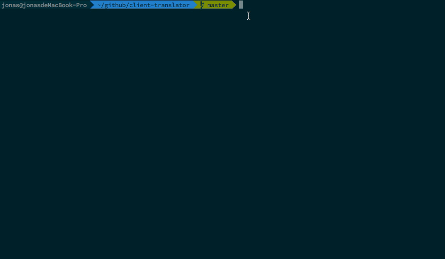

<h1 align="center">client-translator</h1>

<p align="center">百度, 有道翻译,查词</p>

<p align="center"></p>

## 环境要求

* PHP >= 5.6
* Composer

## 安装
### 全局安装

``` shell
$ composer global require jonasrepo/client-translator
```

### 当前目录安装

``` shell
$ composer create-project jonasrepo/client-translator
```

## 使用

``` shell
$ ./path/client-translator/tsl "今天天气不错"
$ ./path/client-translator/tsl "今天天气不错"  -f youdao,baidu
```

## LICENSE
MIT